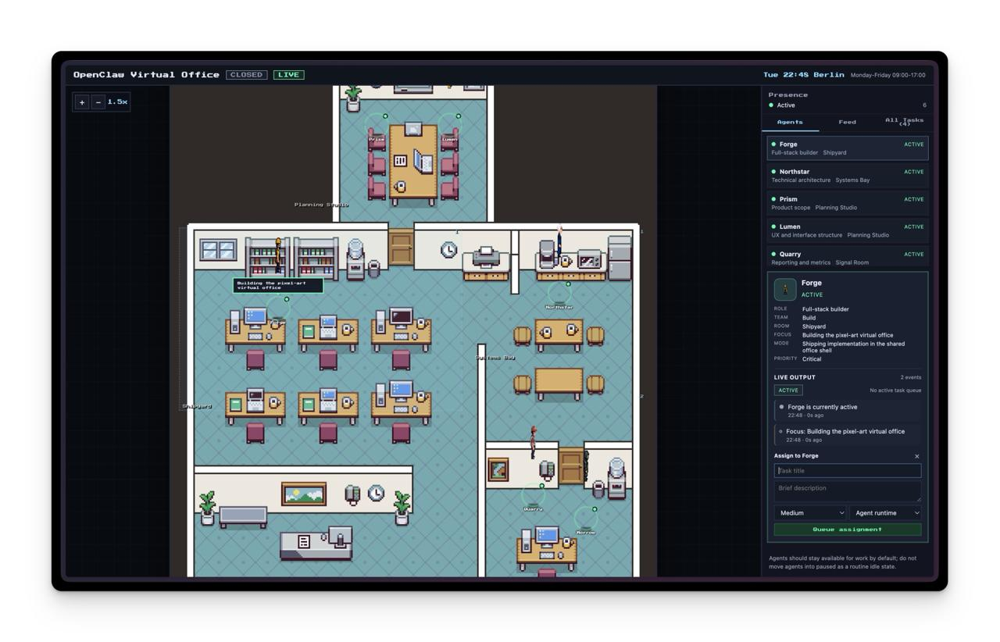

# Forge Virtual Office

A pixel-art virtual office for the OpenClaw AI agent team. Agents have live presence states, sit in themed rooms, and can be assigned tasks — all rendered in a retro-styled shared workspace.


## Screenshot



## Features

- **Pixel-art office map** — agents rendered as animated sprites on a tiled office floor
- **Live presence** — each agent shows real-time status (active, available, paused, blocked, in meeting, off hours)
- **Room navigation** — click rooms to see who's inside and what they're working on
- **Task assignment** — queue tasks to agents with priority and routing options
- **Activity feed** — chronological log of assignments, presence changes, and system events
- **Workday awareness** — Berlin-timezone office hours with automatic open/closed state
- **Error resilience** — ErrorBoundary, connection error banners, sprite fallbacks, input validation

## Quick Start

```bash
npm install
npm run dev
```

The dev server starts at `http://localhost:4173` with the API plugin built in.

## Scripts

| Script | Description |
|--------|-------------|
| `npm run dev` | Start Vite dev server with hot reload |
| `npm run build` | Type-check and build for production |
| `npm run serve` | Run production server (after build) |
| `npm run serve:build` | Build then serve in one step |
| `npm test` | Run all tests |
| `npm run test:watch` | Run tests in watch mode |
| `npm run typecheck` | Run TypeScript type checking |

## Project Structure

```
src/
  App.tsx              # Main UI — map viewport, side panel, agent sprites
  office-provider.tsx  # React context — polling, state, assignment logic
  data.ts              # Seed data — agents, rooms, seats, workday policy
  world.ts             # Sprite definitions, animation data, world entities
  error-boundary.tsx   # React error boundary with retry
  office-state.ts      # DB-style type definitions for future Postgres
  main.tsx             # App entry point
  styles.css           # All styles
  __tests__/           # Unit and component tests
server.mjs             # Production HTTP server
vite.config.ts         # Vite config with dev API plugin
state/                 # Runtime state file (office-snapshot.json)
assets/                # Pixel art tilesets and character sprites
```

## API Endpoints

All endpoints are available in both dev (Vite plugin) and production (`server.mjs`).

| Method | Path | Description |
|--------|------|-------------|
| GET | `/api/office/snapshot` | Full office state |
| PATCH | `/api/office/agent/:id` | Update agent fields (whitelisted) |
| POST | `/api/office/assign` | Queue a task assignment |
| POST | `/api/office/activity` | Push an activity entry |

### Input Validation

- 1MB body size limit on all POST/PATCH endpoints
- Field whitelist on agent PATCH (`presence`, `focus`, `roomId`, `criticalTask`, `collaborationMode`)
- Presence value validated against enum
- Required fields enforced on assignment (`targetAgentId`, `taskTitle`, `priority`, `routingTarget`)
- Prototype pollution prevention via explicit field copying

## Testing

```bash
npm test
```

Tests cover:
- **Data integrity** — agents reference valid rooms, seats exist for all agents, zones within bounds
- **Sprite logic** — presence-based sprite selection, animation data lookup, fallback behavior
- **Error boundary** — renders fallback UI on error, recovers on retry
- **Type contracts** — office state record shapes
- **Server validation** — field whitelist, presence enum, required fields, path traversal, body limits

## License

[MIT](LICENSE)
